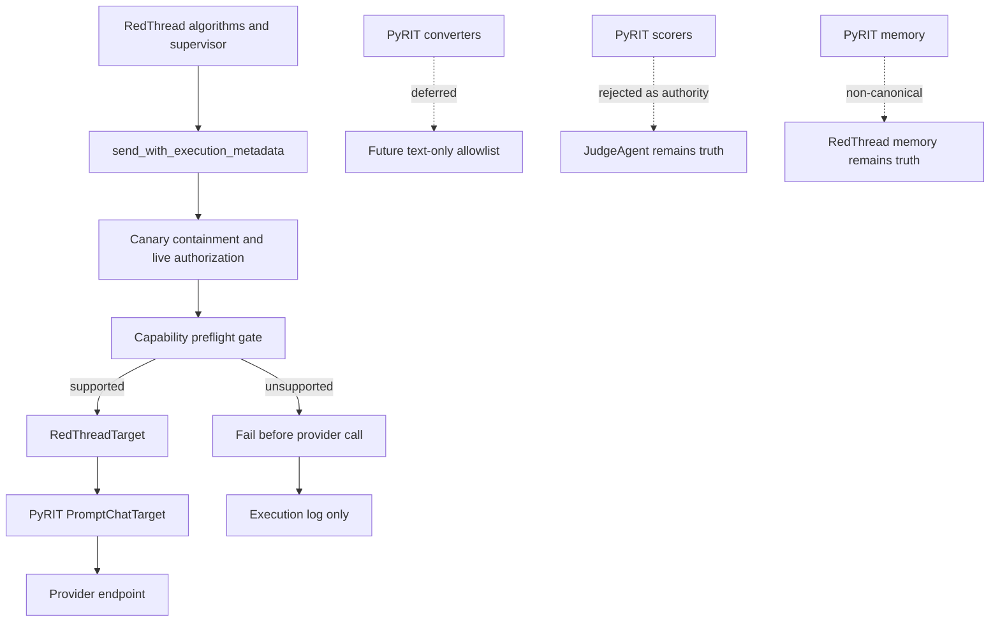

# Architecture

## PyRIT adapter capability gates

RedThread will keep PyRIT behind a thin adapter boundary. The new architecture adds a RedThread-owned capability contract between RedThread send paths and PyRIT prompt targets. The contract records only what RedThread needs to know: multi-turn support, multi-message support, JSON support, editable history, and supported input/output modalities.

The capability gate runs before provider calls when a caller requests behavior beyond the default text send. If the target cannot support the requested mode, RedThread fails before execution and records the failure in execution logs. Operator reports are unchanged in this phase.

Converters are intentionally deferred. They can be revisited after the capability gate lands, as a separate text-only allowlist hidden behind strategy internals.

Threat model notes: the main risks are bypassing containment by adding a second send path, treating PyRIT capability claims as proof, leaking PyRIT memory into RedThread truth, and scope creep into converters or scorers. The mitigation is one shared send boundary, fail-closed preflight, logs-only unsupported failures, and tests that assert no provider call happens when a required capability is missing.
